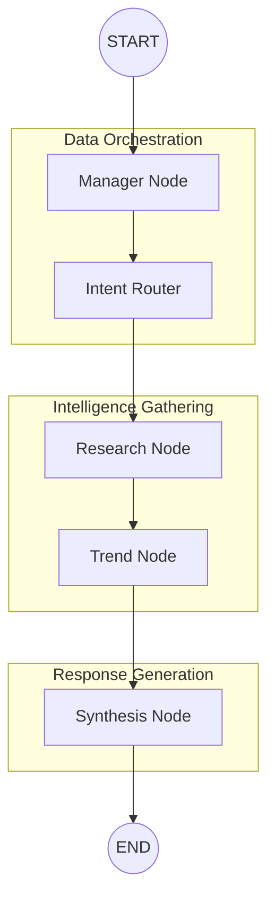

# Personal Portfolio AI Advisor - Backend

An agentic AI system built with **LangGraph**, **MongoDB Atlas**, and **Cohere** to provide personalized financial analysis and portfolio recommendations.

## 🚀 Overview

This backend system leverages a multi-node agent graph to:
1. **Manager Node**: Retrieve and hydrate user profiles and portfolio data from MongoDB.
2. **Intent Router Node**: Analyze user queries to filter relevant stocks or identify new tickers (like Google/GOOGL) for research.
3. **Research Node**: Perform sequential RAG-based research on identified stocks using `yfinance` and MongoDB Atlas Vector Search (Voyage AI embeddings). Includes aggressive throttling to bypass rate limits.
4. **Trend Node**: Aggregate technical signals and platform-wide trending stocks.
5. **Synthesis Node**: Generate concise answers or full personalized Markdown reports using Cohere's Command-R+.

## 🛠 Tech Stack

- **Framework**: FastAPI
- **Orchestration**: LangGraph (StateGraph)
- **Database**: MongoDB Atlas (Vector Search & Persistence)
- **LLM**: Cohere (command-r-plus-08-2024)
- **Embeddings**: Voyage AI (voyage-finance-2)
- **Data Source**: Yahoo Finance (yfinance)

## 📡 API Documentation for Frontend

The backend runs by default on `http://localhost:8000`.

### 1. Portfolio Analysis
**Endpoint:** `POST /analyze/{user_id}`

Runs the full analysis graph for a specific user.

Runs the full analysis graph for a specific user.

- **URL Params**: `user_id` (e.g., `thanushcurtis`)
- **Response**:
  ```json
  {
    "report": "# Personalized Financial Report for Thanush..."
  }
  ```

### 2. Chat-Driven Analysis
**Endpoint:** `POST /chat`

Allows users to ask specific questions about their portfolio.

Allows users to ask specific questions about their portfolio or any stock ticker.

- **Request Body**:
  ```json
  {
    "user_id": "thanushcurtis",
    "message": "What is Google's stock price today?"
  }
  ```
- **Response**:
  ```json
  {
    "report": "Google (GOOGL) is currently trading at $172.50..."
  }
  ```

### 3. Health Check
**Endpoint:** `GET /health`

- **Response:** `{"status": "healthy"}`

---

## ⚙️ Local Setup

1. **Environment Variables**: Create a `.env` file with:
   ```env
   MONGO_URI=your_mongodb_atlas_uri
   COHERE_API_KEY=your_cohere_key
   VOYAGE_API_KEY=your_voyage_key
   ```

2. **Conda Environment**:
   ```bash
   conda activate portfolio-agent
   pip install -r requirements.txt
   ```

3. **Run Backend**:
   ```bash
   python main.py
   ```

## 🏗 Multi-Agent System Architecture

The system is built as a stateful agentic graph using **LangGraph**. It orchestrates multiple specialized "nodes" that act as independent agents to process a user's request.

### 📊 Agent Workflow


### 🤖 Node Breakdown

- **Manager Node**: The entry point. It fetches the user's financial profile, risk tolerance, and current holdings from **MongoDB Atlas**. It "hydrates" the graph state with this personal context.
- **Intent Router**: A decision-making layer that analyzes the user's natural language input. It determines whether the user is asking about their whole portfolio or specific tickers (even those not yet owned), allowing the system to focus its API calls and tokens.
- **Research Node**: The "Deep Diver." For each identified ticker, it performs a sequential analysis:
    - Fetches the latest news via `yfinance`.
    - Cross-references news with **MongoDB Atlas Vector Search** for historical market intelligence.
    - Uses an LLM to generate a concise summary of the stock's current sentiment.
- **Trend Node**: The "Market Scanner." It pulls real-time technical indicators (50-day moving averages, current prices) and aggregates platform-wide trending data to provide a "Macro" perspective.
- **Synthesis Node**: The "Advisor." It takes the outputs from all previous nodes and the user's specific question to generate a final, personalized response in professional Markdown.

### 🛡 Stability Features
- **Rate Limit Resilience**: All `yfinance` calls are throttled with 3s intervals and use a randomized `User-Agent` session.
- **Price Fallback**: If the `yfinance` library is blocked, the system automatically falls back to raw HTTP requests to the Yahoo Chart API.
- **Sequential Research**: Concurrency is disabled (`max_workers=1`) to ensure IP reputation is maintained during heavy analysis.

Each step updates a shared `PortfolioState` which is persisted across turns in MongoDB.

---

## 🎨 Frontend UI (Vite + React)

The project includes a modern React dashboard located in the `/portfolio-ui` directory.

### Setup & Run UI

1. **Navigate to directory**:
   ```bash
   cd portfolio-ui
   ```

2. **Install Dependencies**:
   ```bash
   npm install
   ```

3. **Run Development Server**:
   ```bash
   npm run dev
   ```

The dashboard will be available at `http://localhost:5173`. Make sure the Backend is running on port 8000 for the UI to fetch data correctly.

